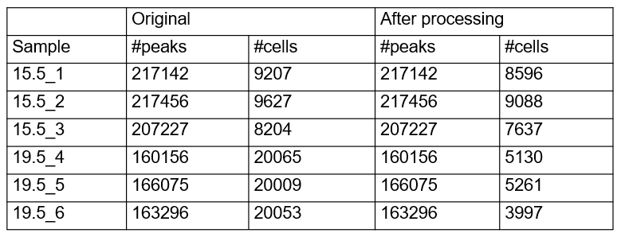

  
```{r setup, include=FALSE}
options(max.print = "75")
knitr::opts_chunk$set(
  echo = TRUE,
  collapse = TRUE,
  comment = "#>",
  fig.path = "Files/",
  fig.width = 15,
  prompt = FALSE,
  tidy = FALSE,
  message = FALSE,
  warning = TRUE
)
knitr::opts_knit$set(width = 75)
```

This is a documentation for analyses of scATAC-seq data, generated from rat metrial gland tissues on gestational day (GD) 15.5 and 19.5. <br>

First, build gene and biotype list, and load the chromosome sizes. Chromosome sizes were downloaded from RGD.

```{r}
library(Signac)
library(Seurat)
library(ggplot2)
library(GenomicRanges)
library(patchwork)
library(hdf5r)
set.seed(1234)

#creating granges object with TSS positions
mart <- biomaRt::useMart("ensembl", host = "http://sep2019.archive.ensembl.org", dataset = "rnorvegicus_gene_ensembl")
rnor6 <- biomaRt::getBM(attributes = c("ensembl_gene_id", "external_gene_name", "chromosome_name",
                                       "start_position", "end_position", "strand", "gene_biotype"), mart = mart)
rnor6 <- subset(rnor6, rnor6$gene_biotype == "protein_coding")
rnor6 <- subset(rnor6, rnor6$chromosome_name %in% c(seq(1, 20), "X", "Y"))
rnor6 <- rnor6[order(rnor6$chromosome_name),]
rnor6$strand <- ifelse(rnor6$strand == "1", "+", "-")
rnor6.ranges <- makeGRangesFromDataFrame(rnor6, seqnames.field = "chromosome_name",
                                         start.field = "start_position",
                                         end.field = "end_position",
                                         strand.field = "strand",
                                         keep.extra.columns = TRUE)
tss.ranges <- resize(rnor6.ranges, width = 2, fix = "start")
tss.ranges <- keepStandardChromosomes(tss.ranges, pruning.mode = 'coarse')

#rn6 chromosome sizes
rn6 <- read.table("/work/LAS/geetu-lab/hhvu/project3_scATAC/rn6.size", header = F)
rn6Chr <- paste0(rn6$V1, "-1-", sep = "")
rn6Chr <- paste0(rn6Chr, rn6$V2, sep = "")
```

Next, we call peaks using MACS (built in with `Signac`), and build a new Signac object for downstream analyses.
```{r}
dir <- "/work/LAS/geetu-lab/hhvu/project3_scATAC/data/scATAC-seq/"
dirsave <- "/work/LAS/geetu-lab/hhvu/project3_scATAC/scATAC-seq-analysis/finalWorkflow/1_preprocess/"
for (time in c("15.5", "19.5")) {
  for (i in 1:3) {
    dir1 <- paste0(dir, "GD", time, "/ATAC-", time, "-", i, "/")
    counts <- Read10X_h5(paste0(dir1, "filtered_peak_bc_matrix.h5"))
    metadata <- read.csv(paste0(dir1, "singlecell.csv"), header = T, row.names = 1)
    fragments <- paste0(dir1, "fragments.tsv.gz")
    rats_assay <- CreateChromatinAssay(counts = counts, sep = c(":", "-"), fragments = fragments, min.cells = 1)
    #creating Seurat object
    rats <- CreateSeuratObject(counts = rats_assay, assay = 'peaks', project = 'ATAC',  meta.data = metadata)
    
    #call MACS peaks
    peaks <- CallPeaks(object = rats)
    
    #get counts in MACS peaks
    newPeaks.counts <- FeatureMatrix(fragments=Fragments(rats), features=peaks, cells=colnames(rats))
    
    #build new Signac object
    assay <- CreateChromatinAssay(newPeaks.counts, fragments = Fragments(rats))
    MACS <- CreateSeuratObject(assay, assay = "MACSpeaks")
    
    #calculate the total number of fragments in cells
    MACS@meta.data$total_fragments <- rats@meta.data$passed_filters
    
    #calculate the total number of fragments in peaks:
    peak_region_fragments <- colSums(newPeaks.counts)
    MACS@meta.data$peak_region_fragments <- peak_region_fragments
    
    #calculate FRiP
    MACS$pct_reads_in_peaks <- MACS$peak_region_fragments / MACS$total_fragments * 100
    
    #compute nucleosome signal score per cell
    MACS <- NucleosomeSignal(object = MACS)
    
    #compute TSS enrichment score per cell
    MACS <- TSSEnrichment(object = MACS, fast = FALSE, tss.positions = tss.ranges)

    save(MACS, file=paste0(dirsave, "2_MACS2Peaks/3_unfilteredObjects-MACSpeaks/GD", time, "_", i, ".rda"))
    
    print(MACS)
  }
}
```

Next, we build a preprocessing function.
```{r}
processing <- function(data) {
  print("quantile(TSS.enrichment)")
  quantile(data$TSS.enrichment)
  data$high.tss <- ifelse(data$TSS.enrichment > 1.5, 'High', 'Low')
  
  print("quantile(peak_region_fragments)")
  quantile(data$peak_region_fragments)
  
  print(VlnPlot(object = data, features = c('pct_reads_in_peaks', 'peak_region_fragments', 'TSS.enrichment', 'nucleosome_signal'), pt.size = 0.1, ncol = 4))
}
```

We now use this `preprocessing` function to assess the quality of the data.
```{r}
dir <- "/work/LAS/geetu-lab/hhvu/project3_scATAC/data/scATAC-seq/"
dirsave <- "/work/LAS/geetu-lab/hhvu/project3_scATAC/scATAC-seq-analysis/finalWorkflow/1_preprocess/"
for (time in c("15.5", "19.5")) {
  for (i in 1:3) {
    load(paste0(dirsave, "2_MACS2Peaks/3_unfilteredObjects-MACSpeaks/GD", time, "_", i, ".rda"))
    print(paste0("GD", time, "_", i))
    processing(MACS)
  }
}
```
From the plots, we will keep cells that have `1000 < peak_region_fragments < 20000` (number of fragments in peaks between 1000 and 20000), `pct_reads_in_peaks > 15` (percentage of reads in peaks > 15\%), and `TSS.enrichment > 1.5` (enrichment ratio at transcription start sites > 1.5).

```{r}
dir <- "/work/LAS/geetu-lab/hhvu/project3_scATAC/data/scATAC-seq/"
dirsave <- "/work/LAS/geetu-lab/hhvu/project3_scATAC/scATAC-seq-analysis/finalWorkflow/1_preprocess/"
for (time in c("15.5", "19.5")) {
  for (i in 1:3) {
    load(paste0(dirsave, "2_MACS2Peaks/3_unfilteredObjects-MACSpeaks/GD", time, "_", i, ".rda"))
    print(paste0("GD", time, "_", i))
    MACS <- subset(x = MACS, subset =  peak_region_fragments > 1000 & peak_region_fragments < 20000 &  pct_reads_in_peaks > 15 & TSS.enrichment > 1.5)
    print(MACS)
  }
}
```

In conclusion, we have this summary table of objects before and after filtering:
```{r}

```