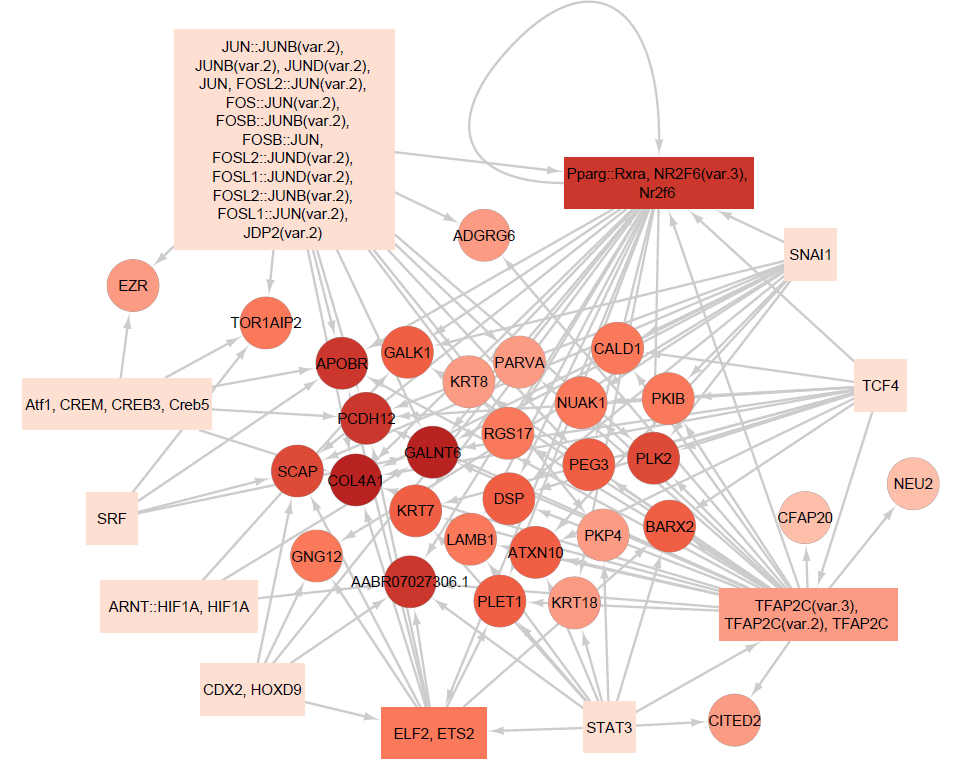
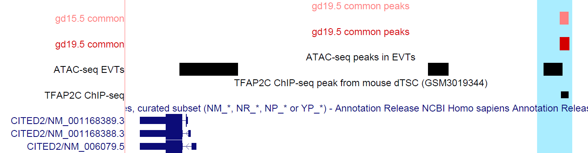

  
```{r setup, include=FALSE}
options(max.print = "75")
knitr::opts_chunk$set(
  echo = TRUE,
  collapse = TRUE,
  comment = "#>",
  fig.path = "Files/",
  fig.width = 15,
  prompt = FALSE,
  tidy = FALSE,
  message = FALSE,
  warning = TRUE
)
knitr::opts_knit$set(width = 75)
```

This is a documentation for analyses of scATAC-seq data, generated from rat metrial gland tissues on gestational day (GD) 15.5 and 19.5. <br>

We first define common peaks to regions enriched in TBC cluster at GD15.5 and GD19.5 that overlap by at least 50\%. <br>
```{BASH, eval = F}
module load bedtools2

bedtools intersect -a /work/LAS/geetu-lab/hhvu/project3_scATAC/scATAC-seq-analysis/4_RNAintegration/2_MACS2Peaks/annotation_scRNAseq/gd15.5-tbc.bed -b /work/LAS/geetu-lab/hhvu/project3_scATAC/scATAC-seq-analysis/4_RNAintegration/2_MACS2Peaks/annotation_scRNAseq/gd19.5-tbc.bed -f 0.5 -r -wa -wb > /work/LAS/geetu-lab/hhvu/project3_scATAC/scATAC-seq-analysis/5_integrating2timepoints/annotation_scRNAseq/commonPeaks/commonPeaks.bed

cd /work/LAS/geetu-lab/hhvu/project3_scATAC/scATAC-seq-analysis/5_integrating2timepoints/annotation_scRNAseq/commonPeaks/
cut -f1-4 commonPeaks.bed | sort -u > commonPeaks-gd15.5.bed
cut -f5-8 commonPeaks.bed | sort -u > commonPeaks-gd19.5.bed
```


## GO analysis of peaks
Timepoint-unique peaks are peaks at each timepoint that are not in the common set.
```
cd /work/LAS/geetu-lab/hhvu/project3_scATAC/scATAC-seq-analysis/5_integrating2timepoints/annotation_scRNAseq/commonPeaks/20220919_allPeaks

sed 's/^/chr/g' gd15.5-tbc.bed | bedtools intersect -a - -b commonPeaks-gd15.5.bed -v > gd15.5uniq.bed
bedtools intersect -a gd19.5-tbc.bed -b commonPeaks-gd19.5.bed -v | sed 's/^/chr/g' > gd19.5uniq.bed

wc -l *uniq.bed
  2600 gd15.5uniq.bed
   791 gd19.5uniq.bed

wc -l gd1*.5uniq-hg38Coor.bed
  1792 gd15.5uniq-hg38Coor.bed
   548 gd19.5uniq-hg38Coor.bed
```
Convert the coordinates from rat to human, then see how many of the peaks are in EVT
```
sed 's/chr//g' gd15.5uniq-hg38Coor.bed | bedtools intersect -a - -b EVTpeaks.bed -wa -u > gd15.5uniq-hg38Coor-inEVT.bed
sed 's/chr//g' gd19.5uniq-hg38Coor.bed | bedtools intersect -a - -b EVTpeaks.bed -wa -u > gd19.5uniq-hg38Coor-inEVT.bed

wc -l gd1*.5uniq-hg38Coor-inEVT.bed
  459 gd15.5uniq-hg38Coor-inEVT.bed
  128 gd19.5uniq-hg38Coor-inEVT.bed
```

Associate the peaks to the nearest genes, then run GO analysis.
```{r}
library(Signac)
library(Seurat)
library(JASPAR2020)
library(TFBSTools)
library(BSgenome.Rnorvegicus.Ensembl.rn6)
library(patchwork)
library(dplyr)
library(org.Rn.eg.db)
library(clusterProfiler)
set.seed(1234)

go <- function(genes) {
  GO <- enrichGO(gene = genes, OrgDb=org.Rn.eg.db, ont = "BP", pvalueCutoff = 0.05, qvalueCutoff = 0.05, maxGSSize=500, readable = T, keyType = "ENSEMBL")
  goSimplify <- simplify(GO)
  res <- as.data.frame(goSimplify)
  #res$Rank <- seq(1, nrow(res))
  res$GeneRatio <- sapply(strsplit(res$GeneRatio, "/"), function(x) as.numeric(x[1])/as.numeric(x[2]))
  res$BgRatio <- sapply(strsplit(res$BgRatio, "/"), function(x) as.numeric(x[1])/as.numeric(x[2]))
  res$Fold <- as.numeric(res$GeneRatio)/as.numeric(res$BgRatio)
  res <- res[res$qvalue <= 0.05 & res$Fold >= 2 & res$Count >= 5,]
  
  return(res)
}

load("/work/LAS/geetu-lab/hhvu/project3_scATAC/rnor6.ranges.rda")
load("/work/LAS/geetu-lab/hhvu/project3_scATAC/scATAC-seq-analysis/4_RNAintegration/2_MACS2Peaks/annotation_scRNAseq/gd15.5-ATACwithRNAlables.rda")
Idents(rats) <- rats@meta.data$predicted.id # change from old identities to those predicted by scRNA-seq
DefaultAssay(rats) <- 'MACSpeaks'
Annotation(rats) <- rnor6.ranges
peaks <- read.table("/work/LAS/geetu-lab/hhvu/project3_scATAC/scATAC-seq-analysis/5_integrating2timepoints/annotation_scRNAseq/commonPeaks/20220919_allPeaks/gd15.5uniq-hg38Coor-inEVT.bed", header=F)
closest_genes <- ClosestFeature(rats, regions = peaks$V4)

r15.5 <- go(closest_genes$ensembl_gene_id)
r15.5
#write.table(r15.5, "/work/LAS/geetu-lab/hhvu/project3_scATAC/scATAC-seq-analysis/5_integrating2timepoints/annotation_scRNAseq/commonPeaks/20220919_allPeaks/gd15.5uniq-hg38Coor-inEVT-go.txt", sep = "\t", row.names = F, quote = F)
```

```{r}
peaks <- read.table("/work/LAS/geetu-lab/hhvu/project3_scATAC/scATAC-seq-analysis/5_integrating2timepoints/annotation_scRNAseq/commonPeaks/20220919_allPeaks/gd15.5uniq.bed", header=F)
closest_genes <- ClosestFeature(rats, regions = peaks$V4)

r15.5uniqAll <- go(closest_genes$ensembl_gene_id)
r15.5uniqAll
write.table(r15.5uniqAll, "/work/LAS/geetu-lab/hhvu/project3_scATAC/scATAC-seq-analysis/5_integrating2timepoints/annotation_scRNAseq/commonPeaks/20220919_allPeaks/gd15.5uniqAll-go.txt", sep = "\t", row.names = F, quote = F)
```

```{r}
load("/work/LAS/geetu-lab/hhvu/project3_scATAC/rnor6.ranges.rda")
load("/work/LAS/geetu-lab/hhvu/project3_scATAC/scATAC-seq-analysis/4_RNAintegration/2_MACS2Peaks/annotation_scRNAseq/gd19.5-ATACwithRNAlables.rda")
Idents(rats) <- rats@meta.data$predicted.id # change from old identities to those predicted by scRNA-seq
DefaultAssay(rats) <- 'MACSpeaks'
Annotation(rats) <- rnor6.ranges
peaks <- read.table("/work/LAS/geetu-lab/hhvu/project3_scATAC/scATAC-seq-analysis/5_integrating2timepoints/annotation_scRNAseq/commonPeaks/20220919_allPeaks/gd19.5uniq-hg38Coor-inEVT.bed", header=F)
closest_genes <- ClosestFeature(rats, regions = peaks$V4)

r19.5 <- go(closest_genes$ensembl_gene_id)
r19.5
write.table(r19.5, "/work/LAS/geetu-lab/hhvu/project3_scATAC/scATAC-seq-analysis/5_integrating2timepoints/annotation_scRNAseq/commonPeaks/gd19.5uniq-hg38Coor-inEVT-go.txt", sep = "\t", row.names = F, quote = F)
```

```{r}
peaks <- read.table("/work/LAS/geetu-lab/hhvu/project3_scATAC/scATAC-seq-analysis/5_integrating2timepoints/annotation_scRNAseq/commonPeaks/20220919_allPeaks/gd19.5uniq.bed", header=F)
closest_genes <- ClosestFeature(rats, regions = peaks$V4)

r19.5uniqAll <- go(closest_genes$ensembl_gene_id)
r19.5uniqAll
write.table(r19.5uniqAll, "/work/LAS/geetu-lab/hhvu/project3_scATAC/scATAC-seq-analysis/5_integrating2timepoints/annotation_scRNAseq/commonPeaks/20220919_allPeaks/gd19.5uniqAll-go.txt", sep = "\t", row.names = F, quote = F)
```

Using GD19.5 coordinates, associate the conserved common peaks to the nearest genes, then run GO analysis.
```{r}
load("/work/LAS/geetu-lab/hhvu/project3_scATAC/rnor6.ranges.rda")
load("/work/LAS/geetu-lab/hhvu/project3_scATAC/scATAC-seq-analysis/4_RNAintegration/2_MACS2Peaks/annotation_scRNAseq/gd19.5-ATACwithRNAlables.rda")
Idents(rats) <- rats@meta.data$predicted.id # change from old identities to those predicted by scRNA-seq
DefaultAssay(rats) <- 'MACSpeaks'
Annotation(rats) <- rnor6.ranges

peaks <- read.table("/work/LAS/geetu-lab/hhvu/project3_scATAC/scATAC-seq-analysis/5_integrating2timepoints/annotation_scRNAseq/commonPeaks/commonPeaks-gd19.5.bed", header=F)
closest_genes <- ClosestFeature(rats, regions = peaks$V4)

r <- go(closest_genes$ensembl_gene_id)
r
write.table(r, "/work/LAS/geetu-lab/hhvu/project3_scATAC/scATAC-seq-analysis/5_integrating2timepoints/annotation_scRNAseq/commonPeaks/conservedCommonPeaks-gd19.5-go.txt", sep = "\t", row.names = F, quote = F)


peaks <- read.table("/work/LAS/geetu-lab/hhvu/project3_scATAC/scATAC-seq-analysis/5_integrating2timepoints/annotation_scRNAseq/commonPeaks/commonPeaks-gd19.5-hg38Coor-inEVT.bed", header=F)
closest_genes <- ClosestFeature(rats, regions = peaks$V4)

r <- go(closest_genes$ensembl_gene_id)
r
write.table(r, "/work/LAS/geetu-lab/hhvu/project3_scATAC/scATAC-seq-analysis/5_integrating2timepoints/annotation_scRNAseq/commonPeaks/conservedCommonPeaks-gd19.5-go.txt", sep = "\t", row.names = F, quote = F)

r <- r[r$Description %in% c("angiogenesis",
                            "branching morphogenesis of an epithelial tube",
                            "embryonic placenta development",
                            "integrin-mediated signaling pathway",
                            "regulation of cell-matrix adhesion"),]

ggplot(data=r, aes(x=reorder(Description, -log10(as.numeric(qvalue))), y=-log10(as.numeric(qvalue)))) +
  geom_bar(stat="identity", fill="#008837", width = 0.7) + coord_flip() +
  labs(title = "Conserved common peaks",
       y = "-log10(q-value)",
       x = "") +
  theme(plot.title = element_text(size = 25, face = "bold"), legend.text=element_text(size=25),
        axis.text=element_text(size=25), axis.title.x = element_text(size = 25))
```

Number of genes associated with the common peaks
```{r}
length(unique(closest_genes$gene_name))
```


## Motif analysis:
We carry out motif analysis with TF motifs from rat, mouse and human database. Firstly, run with rat TFs:
```{r, eval=F}
load("/work/LAS/geetu-lab/hhvu/project3_scATAC/scATAC-seq-analysis/4_RNAintegration/2_MACS2Peaks/annotation_scRNAseq/gd19.5-ATACwithRNAlables.rda")
Idents(rats) <- rats@meta.data$predicted.id # change from old identities to those predicted by scRNA-seq
DefaultAssay(rats) <- 'MACSpeaks'

peaks <- read.table("/work/LAS/geetu-lab/hhvu/project3_scATAC/scATAC-seq-analysis/5_integrating2timepoints/annotation_scRNAseq/commonPeaks/commonPeaks.bed", header=F)
top.peaks <- unique(peaks$V8)

open.peaks <- AccessiblePeaks(rats, assay = "MACSpeaks", min.cells = 1)

rats <- RegionStats(rats[['MACSpeaks']], genome=BSgenome.Rnorvegicus.Ensembl.rn6)
meta.feature <- GetAssayData(rats, assay = "MACSpeaks", slot = "meta.features")
peaks.matched <- MatchRegionStats(meta.feature = meta.feature[open.peaks, ], query.feature = meta.feature[top.peaks, ], n = 50000, features.match = c("GC.percent", "sequence.length"))

#rats
pfm <- getMatrixSet(x = JASPAR2020, opts = list(species = "Rattus norvegicus", all_versions = FALSE))
motif.matrix <- CreateMotifMatrix(features = granges(rats), pwm = pfm, genome = BSgenome.Rnorvegicus.Ensembl.rn6, p.cutoff = 0.00005)
motif.positions <- motifmatchr::matchMotifs(pwms = pfm, subject = granges(rats), out = 'positions', genome = BSgenome.Rnorvegicus.Ensembl.rn6)
motif <- CreateMotifObject(data = motif.matrix, positions = motif.positions, pwm = pfm)
rats <- SetAssayData(object = rats, slot = 'motifs', new.data = motif)


enriched.motifs <- FindMotifs(object=rats, features=top.peaks, background=peaks.matched)

#write.table(enriched.motifs, "/work/LAS/geetu-lab/hhvu/project3_scATAC/scATAC-seq-analysis/5_integrating2timepoints/annotation_scRNAseq/commonPeaks/GD19.5_motifAnalysis/common19.5-ratsMotifs.txt", quote=F)
#save(rats, file = "/work/LAS/geetu-lab/hhvu/project3_scATAC/scATAC-seq-analysis/5_integrating2timepoints/annotation_scRNAseq/commonPeaks/GD19.5_motifAnalysis/gd19.5_ATACwithRatPFM.rda")
```
Mouse motifs:
```{r, eval=F}
pfm <- getMatrixSet(x = JASPAR2020, opts = list(species = "Mus musculus", all_versions = FALSE))
motif.matrix <- CreateMotifMatrix(features = granges(rats), pwm = pfm, genome = BSgenome.Rnorvegicus.Ensembl.rn6, p.cutoff = 0.00005)
motif.positions <- motifmatchr::matchMotifs(pwms = pfm, subject = granges(rats), out = 'positions', genome = BSgenome.Rnorvegicus.Ensembl.rn6)
motif <- CreateMotifObject(data = motif.matrix, positions = motif.positions, pwm = pfm)
rats <- SetAssayData(object = rats, slot = 'motifs', new.data = motif)

enriched.motifs <- FindMotifs(object=rats, features=top.peaks, background=peaks.matched)

#write.table(enriched.motifs, "/work/LAS/geetu-lab/hhvu/project3_scATAC/scATAC-seq-analysis/5_integrating2timepoints/annotation_scRNAseq/commonPeaks/GD19.5_motifAnalysis/common19.5-mouseMotifs.txt", quote=F)
#save(rats, file = "/work/LAS/geetu-lab/hhvu/project3_scATAC/scATAC-seq-analysis/5_integrating2timepoints/annotation_scRNAseq/commonPeaks/GD19.5_motifAnalysis/gd19.5_ATACwithMousePFM.rda")
```
Human motifs:
```{r, eval=F}
pfm <- getMatrixSet(x = JASPAR2020, opts = list(species = "Homo sapiens", all_versions = FALSE))
motif.matrix <- CreateMotifMatrix(features = granges(rats), pwm = pfm, genome = BSgenome.Rnorvegicus.Ensembl.rn6, p.cutoff = 0.00005)
motif.positions <- motifmatchr::matchMotifs(pwms = pfm, subject = granges(rats), out = 'positions', genome = BSgenome.Rnorvegicus.Ensembl.rn6)
motif <- CreateMotifObject(data = motif.matrix, positions = motif.positions, pwm = pfm)
rats <- SetAssayData(object = rats, slot = 'motifs', new.data = motif)

enriched.motifs <- FindMotifs(object=rats, features=top.peaks, background=peaks.matched)

#write.table(enriched.motifs, "/work/LAS/geetu-lab/hhvu/project3_scATAC/scATAC-seq-analysis/5_integrating2timepoints/annotation_scRNAseq/commonPeaks/GD19.5_motifAnalysis/common19.5-humanMotifs.txt", quote=F)
#save(rats, file = "/work/LAS/geetu-lab/hhvu/project3_scATAC/scATAC-seq-analysis/5_integrating2timepoints/annotation_scRNAseq/commonPeaks/GD19.5_motifAnalysis/gd19.5_ATACwithHumanPFM.rda")
```

Next, we compile the enriched motifs to one table.
```{r}
rat19.5 <- read.table("/work/LAS/geetu-lab/hhvu/project3_scATAC/scATAC-seq-analysis/5_integrating2timepoints/annotation_scRNAseq/commonPeaks/GD19.5_motifAnalysis/common19.5-ratsMotifs.txt", header = T)
rat19.5$adj_pval <- p.adjust(rat19.5$pvalue, "BH")
rat19.5 <- rat19.5[rat19.5$adj_pval <= 0.05 & rat19.5$fold.enrichment >= 1.5,]
rat19.5$type <- "rat"

mouse19.5 <- read.table("/work/LAS/geetu-lab/hhvu/project3_scATAC/scATAC-seq-analysis/5_integrating2timepoints/annotation_scRNAseq/commonPeaks/GD19.5_motifAnalysis/common19.5-mouseMotifs.txt", header = T)
mouse19.5$adj_pval <- p.adjust(mouse19.5$pvalue, "BH")
mouse19.5 <- mouse19.5[mouse19.5$adj_pval <= 0.05 & mouse19.5$fold.enrichment >= 1.5,]
mouse19.5$type <- "mouse"

human19.5 <- read.table("/work/LAS/geetu-lab/hhvu/project3_scATAC/scATAC-seq-analysis/5_integrating2timepoints/annotation_scRNAseq/commonPeaks/GD19.5_motifAnalysis/common19.5-humanMotifs.txt", header = T)
human19.5$adj_pval <- p.adjust(human19.5$pvalue, "BH")
human19.5 <- human19.5[human19.5$adj_pval <= 0.05 & human19.5$fold.enrichment >= 1.5,]
human19.5$type <- "human"

motifs19.5 <- rbind(rat19.5, mouse19.5, human19.5)
write.table(motifs19.5, "/work/LAS/geetu-lab/hhvu/project3_scATAC/scATAC-seq-analysis/5_integrating2timepoints/annotation_scRNAseq/commonPeaks/allMotifs-commonPeaksGD19.5coor.txt", sep = "\t", quote = F)
```

Number of motifs
```{r}
length(motifs19.5$motif)
```

Next, filter and keep only transcription factors (TFs) with enriched motifs and have expression levels > 1 at GD19.5.
```{r}
mouseOrthologs <- read.table("/work/LAS/geetu-lab/hhvu/project3_scATAC/rat-mouseOrthologs.txt", header = T, sep = "\t")
mouseOrthologs <- as.data.frame(apply(mouseOrthologs, 2, toupper))
humanOrthologs <- read.table("/work/LAS/geetu-lab/hhvu/project3_scATAC/rat-humanOrthologs.txt", header = T, sep = "\t")
humanOrthologs <- as.data.frame(apply(humanOrthologs, 2, toupper))

#transforming functions
subVar2 <- function(x) {
  ifelse(grepl("var.2", x, ignore.case = TRUE), gsub("\\(var.2\\)", "", x, ignore.case = TRUE), x)
}
subVar3 <- function(x) {
  ifelse(grepl("var.3", x, ignore.case = TRUE), gsub("\\(var.3\\)", "", x, ignore.case = TRUE), x)
}
subColon <- function(x) {
  ifelse(grepl("::", x, ignore.case = TRUE), strsplit(x, "::"), x)
}

enriched <- motifs19.5[, c("motif", "motif.name", "type")]
enriched2 <- data.frame(motif=NA, motif.name=NA, type=NA, TFgenes=NA)
for (i in 1:nrow(enriched)) {
  if (enriched[i, "type"] == "rat") {
    temp <- enriched[i,]
    temp$TFgenes <- enriched[i, "motif.name"]
    enriched2 <- rbind(enriched2, temp)
  } else if (enriched[i, "type"] == "mouse") {
    temp <- enriched[i,]
    names <- sapply(enriched[i, "motif.name"], subVar2)
    names <- sapply(names, subVar3)
    names <- sapply(names, subColon)
    names <- unlist(names)
    df <- data.frame(tf=toupper(names))
    df <- inner_join(df, mouseOrthologs[, c("Gene.name", "Gene.name.1")], by = c("tf" = "Gene.name.1"))
    temp2 <- temp[rep(seq_len(nrow(temp)), each = length(df$Gene.name)), ]
    temp2$TFgenes <- df$Gene.name
    enriched2 <- rbind(enriched2, temp2)
  } else {
    temp <- enriched[i,]
    names <- sapply(enriched[i, "motif.name"], subVar2)
    names <- sapply(names, subVar3)
    names <- sapply(names, subColon)
    names <- unlist(names)
    df <- data.frame(tf=toupper(names))
    df <- inner_join(df, mouseOrthologs[, c("Gene.name", "Gene.name.1")], by = c("tf" = "Gene.name.1"))
    temp2 <- temp[rep(seq_len(nrow(temp)), each = length(df$Gene.name)), ]
    temp2$TFgenes <- df$Gene.name
    enriched2 <- rbind(enriched2, temp2)
  }
}

load("/work/LAS/geetu-lab/hhvu/project3_scATAC/scATAC-seq-analysis/4_RNAintegration/scRNA-seqFiles/gd19.5-4-5-6-7_res0.8.rda")
exp19.5 <- AverageExpression(data2)
exp19.5 <- as.data.frame(exp19.5$RNA)
rownames(exp19.5) <- toupper(rownames(exp19.5))
g2 <- rownames(exp19.5[rownames(exp19.5) %in% enriched2$TFgenes & exp19.5$`6` > 1,])

enriched2 <- enriched2[enriched2$TFgenes %in% g2,]

motifs19.5 <- motifs19.5[motifs19.5$motif.name %in% enriched2$motif.name,]
write.table(motifs19.5, "/work/LAS/geetu-lab/hhvu/project3_scATAC/scATAC-seq-analysis/5_integrating2timepoints/annotation_scRNAseq/commonPeaks/finalMotifs-commonPeaksGD19.5coor.txt", sep = "\t", quote = F)
```

Number of motifs retained
```{r}
length(motifs19.5$motif)
```

Find peaks that contain the enriched motifs of the expressed TFs. Since the types of the retained motifs were mouse and human, we will load the related objects only.
```{r}
motifs19.5 <- read.table("/work/LAS/geetu-lab/hhvu/project3_scATAC/scATAC-seq-analysis/5_integrating2timepoints/annotation_scRNAseq/commonPeaks/finalMotifs-commonPeaksGD19.5coor.txt", sep = "\t")
load("/work/LAS/geetu-lab/hhvu/project3_scATAC/scATAC-seq-analysis/5_integrating2timepoints/annotation_scRNAseq/commonPeaks/GD19.5_motifAnalysis/gd19.5_ATACwithMousePFM.rda")

temp <- motifs19.5[motifs19.5$type == "mouse",]
motifPeaks <- data.frame(motif=NA, peak=NA)
for (i in 1:nrow(temp)) {
  p <- intersect(closest_genes$query_region, names(which(GetMotifData(rats)[, temp$motif[i]] == 1)))
  temp1 <- data.frame(motif=rep(temp$motif[i], length(p)), 
                      peak=p)
  motifPeaks <- rbind(motifPeaks, temp1)
}

load("/work/LAS/geetu-lab/hhvu/project3_scATAC/scATAC-seq-analysis/5_integrating2timepoints/annotation_scRNAseq/commonPeaks/GD19.5_motifAnalysis/gd19.5_ATACwithHumanPFM.rda")

temp <- motifs19.5[motifs19.5$type == "human",]
for (i in 1:nrow(temp)) {
  p <- intersect(closest_genes$query_region, names(which(GetMotifData(rats)[, temp$motif[i]] == 1)))
  temp1 <- data.frame(motif=rep(temp$motif[i], length(p)), 
                      peak=p)
  motifPeaks <- rbind(motifPeaks, temp1)
}

motifPeaks <- motifPeaks[!is.na(motifPeaks$motif),]
write.table(motifPeaks, "/work/LAS/geetu-lab/hhvu/project3_scATAC/scATAC-seq-analysis/5_integrating2timepoints/annotation_scRNAseq/commonPeaks/commonPeaksGD19.5withFinalMotifs.txt", sep = "\t", row.names = F, quote = F)
```

Number of peaks that contained the retained motifs
```{r}
length(unique(motifPeaks$peak))
```


## Conserved common peak - conserved common gene networks:
Build list of genes that are TBC markers at both gd15.5 and gd19.5 that are conserved in human EVT using scRNA-seq data, and these markers are also near to the common peaks.
```{r}
motifPeaks <- read.table("/work/LAS/geetu-lab/hhvu/project3_scATAC/scATAC-seq-analysis/5_integrating2timepoints/annotation_scRNAseq/commonPeaks/commonPeaksGD19.5withFinalMotifs.txt", header = T)
closest_genes <- read.table("/work/LAS/geetu-lab/hhvu/project3_scATAC/scATAC-seq-analysis/5_integrating2timepoints/annotation_scRNAseq/commonPeaks/commonPeaks-gd19.5-toGenes.txt", header = T)
marker15.5 <- read.table("/work/LAS/geetu-lab/hhvu/project3_scATAC/scATAC-seq-analysis/4_RNAintegration/scRNA-seqFiles/gd15.5-wilcoxin-cluster23.txt", header = T, sep = "\t")
marker19.5 <- read.table("/work/LAS/geetu-lab/hhvu/project3_scATAC/scATAC-seq-analysis/4_RNAintegration/scRNA-seqFiles/gd19.5-wilcoxin-cluster6.txt", header = T, sep = "\t")
markers <- intersect(intersect(marker15.5$gene, marker19.5$gene), closest_genes$gene_name)
#r2 <- go(closest_genes[closest_genes$gene_name %in% markers, "ensembl_gene_id"])
#r
#write.table(r, "/work/LAS/geetu-lab/hhvu/project3_scATAC/scATAC-seq-analysis/5_integrating2timepoints/annotation_scRNAseq/commonPeaks/commonPeaks-gd19.5-go.txt", sep = "\t", row.names = F, quote = F)

conservedRats <- read.table("/work/LAS/geetu-lab/hhvu/project3_scATAC/scATAC-seq-analysis/5_integrating2timepoints/annotation_scRNAseq/commonPeaks/conservedRat.txt", header = T, sep = "\t")

markers <- markers[which(toupper(markers) %in% conservedRats$ratGenes == T)]

length(markers)
```

Convert common peaks (gd19.5 coordinates) to human coordinates using LiftOver, then find the regions that have ATAC-seq peaks in EVT. EVT peaks were obtained from https://www.medrxiv.org/content/10.1101/2022.05.25.22275520v1.full-text
```{Bash, eval = F}
cd /work/LAS/geetu-lab/hhvu/project3_scATAC/scATAC-seq-analysis/5_integrating2timepoints/annotation_scRNAseq/commonPeaks
module load bedtools2
sed -i 's/chr//g' commonPeaks-gd19.5-hg38Coor.bed
bedtools intersect -a commonPeaks-gd19.5-hg38Coor.bed -b EVTpeaks.bed -wa | sort -u > commonPeaks-gd19.5-hg38Coor-inEVT.bed
```

Find peaks with enriched motifs and are also conserved
```{r}
conservedPeaks <- read.table("/work/LAS/geetu-lab/hhvu/project3_scATAC/scATAC-seq-analysis/5_integrating2timepoints/annotation_scRNAseq/commonPeaks/commonPeaks-gd19.5-hg38Coor-inEVT.bed", header = F)
motifPeaks <- motifPeaks[motifPeaks$peak %in% conservedPeaks$V4,]
#write.table(motifPeaks, "/work/LAS/geetu-lab/hhvu/project3_scATAC/scATAC-seq-analysis/5_integrating2timepoints/annotation_scRNAseq/commonPeaks/conservedCommonPeaksGD19.5withFinalMotifs.txt", sep = "\t", row.names = F, quote = F)
```

Number of pekas with enriched motifs and are also conserved
```{r}
length(unique(motifPeaks$peak))
```

Associate peaks/motifs to genes
```{r}
network <- inner_join(closest_genes, motifPeaks, by = c("query_region" = "peak"))
network <- inner_join(network, motifs19.5[,c("motif", "motif.name")], by = c("motif" = "motif"))
network <- network[network$gene_name %in% markers,]
dim(network)
```

Grouping motifs of the same gene families together. Here if two families shared an element, I will also merge them together.
```{r}
jaspar <- read.table("/work/LAS/geetu-lab/hhvu/JASPAR-library.txt", header = T, sep = "\t")
jaspar <- jaspar[jaspar$ID %in% network$motif,]
network <- inner_join(network, jaspar[,c("ID", "Family")], by = c("motif" = "ID"))
keep <- network$Family
keep <- subColon(keep)
for (i in 1:length(keep)) {
  keep[i] <- list(unique(keep[i][[1]]))
  for (j in setdiff(1:length(keep), which(keep %in% keep[i]))) {
    if (sum(keep[j][[1]] %in% keep[i][[1]]) > 0) {
      keep[j] <- keep[i]
    }
  }
}
keep2 <- unlist(lapply(keep, toString))
network$Family2 <- keep2

all <- data.frame(tfGene=character(), regGene=character())
for (i in unique(network$Family2)) {
  tfGene <- unique(network[which(network$Family2 == i), "motif.name"])
  tf <- toString(tfGene)
  regGene <- unique(network[which(network$Family2 == i), "gene_name"])
  tbl <- data.frame(matrix(nrow = length(tfGene)*length(regGene), ncol = 2))
  for (j in 1:length(tfGene)) {
    tbl[((j-1)*length(regGene)+1):(j*length(regGene)),1] <- tf
    tbl[((j-1)*length(regGene)+1):(j*length(regGene)),2] <- as.character(regGene)
  }
  all <- rbind(all, tbl)
}
all$X2 <- toupper(all$X2)
all <- dplyr::distinct(all)

g <- unique(all$X2)
for (k in 1:length(g)) {
  if (length(grep(g[k], all$X1, ignore.case = TRUE)) != 0) {
    all[which(g[k] == all$X2), "X2"] <- all[grep(g[k], all$X1, ignore.case = TRUE)[1], "X1"]
  }
}
all <- dplyr::distinct(all)

write.table(all, "/work/LAS/geetu-lab/hhvu/project3_scATAC/scATAC-seq-analysis/5_integrating2timepoints/annotation_scRNAseq/commonPeaks/conservedCommonPeaksGenes-gd19.5.txt", sep = "\t", row.names = F, quote = F)
```

Build network in Cytoscape.
```{r}

```

Genes with most associated motifs:
```{r}
sort(table(all$X2))[(length(table(all$X2))-10):length(table(all$X2))]
```
TFs with most genes:
```{r}
sort(table(all$X1))[(length(table(all$X1))-5):length(table(all$X1))]
```
```{r}

```

```{r}
library(ensembldb)
library(biovizBase)
load("/work/LAS/geetu-lab/hhvu/project3_scATAC/scATAC-seq-analysis/5_integrating2timepoints/unintegrated_2timepoints.rda")
unintegrated <- RenameIdents(unintegrated, `GD15.5_TBC` = "GD15.5_Trophoblast_cells", `GD19.5_TBC` = "GD19.5_Trophoblast_cells")
DefaultAssay(unintegrated) <- "MACSpeaks"
file <- ensDbFromGtf("/work/LAS/geetu-lab/hhvu/project3_scATAC/scATAC-seq-analysis/Rattus_norvegicus.Rnor_6.0.98.gtf")
rnor6.ensDB <- EnsDb(file)
annotations <- suppressWarnings(GetGRangesFromEnsDb(ensdb = rnor6.ensDB))
seqlevelsStyle(annotations) <- "Ensembl"
Annotation(unintegrated) <- annotations

col <- c("#FF8080", "#D40000")

cov_plot <- CoveragePlot( 
  object = unintegrated,
  region = "1-12808761-12809434", #13928 from gene, coaccess with 1-12821801-12824732 (promoter peak)
  #feature = "Cited2",
  annotation = TRUE,
  peaks = TRUE,
  heights = c(6, 1, 1),
  extend.upstream = 8000,
  extend.downstream = 25000,
  idents = c("GD15.5_Trophoblast_cells", "GD19.5_Trophoblast_cells"),
)
pdf("/work/LAS/geetu-lab/hhvu/project3_scATAC/scATAC-seq-analysis/FIGURES/20220829_draftV3/figure4b-peakCited2.pdf", width = 8, height = 3)
wrap_elements(cov_plot & scale_fill_manual(values = col) & xlab("Chromosome 1 position")) + ggtitle("Distal peak associated with Cited2") + theme(plot.title = element_text(size=18, face = "bold")) 
dev.off()


cov_plot <- CoveragePlot( 
  object = unintegrated,
  region = "3-170530891-170531337",
  feature = "Tfap2c",
  annotation = TRUE,
  peaks = TRUE,
  heights = c(6, 1, 1),
  extend.upstream = 10000,
  extend.downstream = 20000,
  idents = c("GD15.5_Trophoblast_cells", "GD19.5_Trophoblast_cells")
)

cov_plot
```