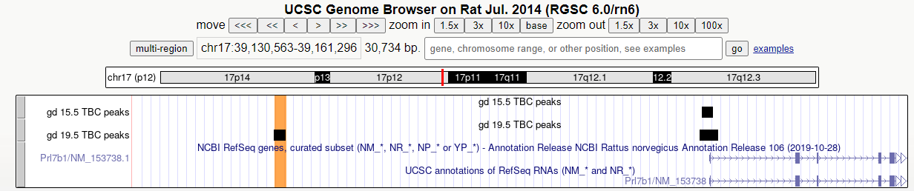

  
```{r setup, include=FALSE}
options(max.print = "75")
knitr::opts_chunk$set(
  echo = TRUE,
  collapse = TRUE,
  comment = "#>",
  fig.path = "Files/",
  fig.width = 15,
  prompt = FALSE,
  tidy = FALSE,
  message = FALSE,
  warning = TRUE
)
knitr::opts_knit$set(width = 75)
```

This is a documentation for analyses of scATAC-seq data, generated from rat metrial gland tissues on gestational day (GD) 15.5 and 19.5. <br>

# Step 1: Merge two objects from two timepoints to one object
```{r, eval = F}
library(Seurat)
library(Signac)
library(Seurat)
library(S4Vectors)
library(GenomicRanges)
library(patchwork)
library(biomaRt)
library(dplyr)
library(ggplot2)
set.seed(1234)
library(parallelly)
library(future)
library(future.apply)
plan("multiprocess", workers = availableCores())
options(future.globals.maxSize = 44440 * 1024^2)

#load gd15.5 files
load("/work/LAS/geetu-lab/hhvu/project3_scATAC/scATAC-seq-analysis/finalWorkflow/4_RNAintegration/2_MACS2Peaks/gd15.5-ATACwithRNAlables.rda")
Idents(rats) <- rats@meta.data$predicted.id # change from old identities to those predicted by scRNA-seq
DefaultAssay(rats) <- 'MACSpeaks'
rats15.5 <- rats
cells_to_reid <- WhichCells(rats15.5, idents = "23")
Idents(rats15.5, cells = cells_to_reid) <- "GD15.5_TBC"

#load gd19.5 files
load("/work/LAS/geetu-lab/hhvu/project3_scATAC/scATAC-seq-analysis/finalWorkflow/4_RNAintegration/2_MACS2Peaks/gd19.5-ATACwithRNAlables.rda")
Idents(rats) <- rats@meta.data$predicted.id # change from old identities to those predicted by scRNA-seq
DefaultAssay(rats) <- 'MACSpeaks'
#Annotation(rats) <- rnor6.ranges
rats19.5 <- rats
cells_to_reid <- WhichCells(rats19.5, idents = "6")
Idents(rats19.5, cells = cells_to_reid) <- "GD19.5_TBC"

#find regions in common
intersecting.regions <- findOverlaps(query=rats15.5, subject=rats19.5)
intersections.19.5 <- unique(queryHits(intersecting.regions))
peaks.use <- sort(granges(rats15.5)[intersections.19.5])

gd15.5_peaks_19.5 <- FeatureMatrix(fragments = Fragments(rats19.5), features = peaks.use, cells = colnames(rats19.5))
#save(gd15.5_peaks_19.5, file="/work/LAS/geetu-lab/hhvu/project3_scATAC/scATAC-seq-analysis/finalWorkflow/6_integrating2timepoints/2_MACS2Peaks/differential/gd15.5_peaks_19.5.rda")

rats19.5[['gd15.5Peaks']] <- CreateChromatinAssay(
  counts = gd15.5_peaks_19.5, #[,colnames(rats19.5)],
  min.cells = 1,
  ranges = peaks.use)
#save(rats19.5, file="/work/LAS/geetu-lab/hhvu/project3_scATAC/scATAC-seq-analysis/finalWorkflow/6_integrating2timepoints/2_MACS2Peaks/differential/19.5-withCommon15.5Assay.rda")

DefaultAssay(rats19.5) <- 'gd15.5Peaks'
rats19.5 <- RunTFIDF(rats19.5)
peaknames <- GRangesToString(grange = peaks.use)
counts <- GetAssayData(rats15.5, assay = "MACSpeaks", slot = "counts")

rats15.5[['gd15.5Peaks']] <- CreateChromatinAssay(
  counts = counts[peaknames, ],
  ranges = peaks.use)

DefaultAssay(rats15.5) <- "gd15.5Peaks"
rats15.5 <- RunTFIDF(rats15.5)
#save(rats15.5, file="/work/LAS/geetu-lab/hhvu/project3_scATAC/scATAC-seq-analysis/finalWorkflow/6_integrating2timepoints/2_MACS2Peaks/differential/15.5-withCommon15.5Assay.rda")

unintegrated <- merge(rats15.5, rats19.5)
DefaultAssay(unintegrated) <- "gd15.5Peaks"
unintegrated <- RunTFIDF(unintegrated)
unintegrated <- FindTopFeatures(unintegrated, min.cutoff = 'q0')
unintegrated <- RunSVD(unintegrated)
unintegrated <- RunUMAP(unintegrated, reduction = 'lsi', dims = 2:20) #20 because I used 20 to do clustering for 15.5, while only 10 for 19.5

save(unintegrated, file="/work/LAS/geetu-lab/hhvu/project3_scATAC/scATAC-seq-analysis/finalWorkflow/5_integrating2timepoints/unintegrated_2timepoints.rda")
```


# Step 2: carry out differential accessibility analysis between two timepoints
```{r}
library(Seurat)
library(Signac)
library(Seurat)
library(S4Vectors)
library(GenomicRanges)
library(patchwork)
library(biomaRt)
library(ggplot2)
set.seed(1234)

load("/work/LAS/geetu-lab/hhvu/project3_scATAC/scATAC-seq-analysis/5_integrating2timepoints/unintegrated_2timepoints.rda")
rats1 <- unintegrated

load("/work/LAS/geetu-lab/hhvu/project3_scATAC/rnor6.rda")
load("/work/LAS/geetu-lab/hhvu/project3_scATAC/rnor6.ranges.rda")

DefaultAssay(rats1) <- 'MACSpeaks'
Annotation(rats1) <- rnor6.ranges

TBC.markers <- FindMarkers(rats1, ident.1 = "GD15.5_TBC", ident.2 = "GD19.5_TBC",  test.use = "LR", latent.vars = 'peak_region_fragments')

write.table(TBC.markers, "/work/LAS/geetu-lab/hhvu/project3_scATAC/scATAC-seq-analysis/5_integrating2timepoints/annotation_scRNAseq/daPeaks/TBC-unfilteredDApeaks.txt", quote = F, sep = '\t')


#check number of cells in each cluster
TBC.markers <- subset(TBC.markers, TBC.markers$p_val_adj <= 0.05)
TBC.15.5 <- subset(TBC.markers, TBC.markers$avg_log2FC >= log2(1.5))
TBC.19.5 <- subset(TBC.markers, TBC.markers$avg_log2FC <= -log2(1.5))
closest_genes_15.5 <- ClosestFeature(rats1, regions = rownames(TBC.15.5), annotation = rnor6.ranges)
closest_genes_19.5 <- ClosestFeature(rats1, regions = rownames(TBC.19.5), annotation = rnor6.ranges)

TBC.15.5$regions <- rownames(TBC.15.5)
new15.5 <- dplyr::left_join(TBC.15.5, closest_genes_15.5, by = c("regions" = "query_region"))
rownames(new15.5) <- new15.5$regions
write.table(new15.5, "/work/LAS/geetu-lab/hhvu/project3_scATAC/scATAC-seq-analysis/5_integrating2timepoints/annotation_scRNAseq/daPeaks/gd15.5TBC.txt", quote = F, sep = '\t')

TBC.19.5$regions <- rownames(TBC.19.5)
new19.5 <- dplyr::left_join(TBC.19.5, closest_genes_19.5, by = c("regions" = "query_region"))
rownames(new19.5) <- new19.5$regions
write.table(new19.5, "/work/LAS/geetu-lab/hhvu/project3_scATAC/scATAC-seq-analysis/5_integrating2timepoints/annotation_scRNAseq/daPeaks/gd19.5TBC.txt", quote = F, sep = '\t')
```

Define GO analysis function:
```{r}
library(org.Rn.eg.db)
library(clusterProfiler)
set.seed(1234)

go <- function(genes) {
  GO <- enrichGO(gene = genes, OrgDb=org.Rn.eg.db, ont = "BP", pvalueCutoff = 0.05, qvalueCutoff = 0.05, maxGSSize=500, readable = T, keyType = "ENSEMBL")
  goSimplify <- simplify(GO)
  res <- as.data.frame(goSimplify)
  #res$Rank <- seq(1, nrow(res))
  res$GeneRatio <- sapply(strsplit(res$GeneRatio, "/"), function(x) as.numeric(x[1])/as.numeric(x[2]))
  res$BgRatio <- sapply(strsplit(res$BgRatio, "/"), function(x) as.numeric(x[1])/as.numeric(x[2]))
  res$Fold <- as.numeric(res$GeneRatio)/as.numeric(res$BgRatio)
  res <- res[res$qvalue <= 0.05 & res$Fold >= 2 & res$Count >= 5,]
  
  return(res)
}
```

GO analysis for closest genes to the DA peaks at both timepoints:
```{r}
new15.5 <- read.table("/work/LAS/geetu-lab/hhvu/project3_scATAC/scATAC-seq-analysis/5_integrating2timepoints/annotation_scRNAseq/daPeaks/gd15.5TBC.txt", header = T)
gd15.5GO <- go(unique(new15.5$ensembl_gene_id))
dim(gd15.5GO)

new19.5 <- read.table("/work/LAS/geetu-lab/hhvu/project3_scATAC/scATAC-seq-analysis/5_integrating2timepoints/annotation_scRNAseq/daPeaks/gd19.5TBC.txt", header = T)
gd19.5GO <- go(unique(new19.5$ensembl_gene_id))
gd19.5GO
```

Number of genes associated with the gd19.5 DA peaks
```{r}
length(unique(new19.5$ensembl_gene_id))
```

From here, we focus on analyzing the peaks more accessible at GD19.5.

# Step 3: Peaks more accessibile at gd19.5 and motif analysis
The distribution of the DA peaks in the genome using GD19.5 coordinates. Since we have to merge objects of two timepoints together, the coordinates of the gd19.5-DA peaks may be slightly different from the original coordinates. We can map that back to the original coordinates with bedtools. In R:
```{r, eval=F}
load("/work/LAS/geetu-lab/hhvu/project3_scATAC/scATAC-seq-analysis/4_RNAintegration/2_MACS2Peaks/annotation_scRNAseq/gd19.5-ATACwithRNAlables.rda")
Idents(rats) <- rats@meta.data$predicted.id # change from old identities to those predicted by scRNA-seq
DefaultAssay(rats) <- 'MACSpeaks'
write.table(rownames(rats), "/work/LAS/geetu-lab/hhvu/project3_scATAC/scATAC-seq-analysis/5_integrating2timepoints/annotation_scRNAseq/daPeaks/allGD19.5peaks.txt", quote = F, row.names = F)
```
In BASH:
```{BASH, eval=F}
cd /work/LAS/geetu-lab/hhvu/project3_scATAC/scATAC-seq-analysis/5_integrating2timepoints/annotation_scRNAseq/daPeaks/
cut -f 1 gd19.5TBC.txt | tail -n +2 | sed 's/-/\t/g' | awk '{print $1"\t"$2"\t"$3"\t"$1"-"$2"-"$3}' > gd19.5TBC-DApeaks.bed
tail -n +2 allGD19.5peaks.txt | sed 's/-/\t/g' | awk '{print $1"\t"$2"\t"$3"\t"$1"-"$2"-"$3}' > allGD19.5peaks.bed

module load bedtools2
bedtools intersect -a allGD19.5peaks.bed -b gd19.5TBC-DApeaks.bed -wa -wb > gd19.5TBC-DApeaks-original.bed
```

```{r}
library(ChIPseeker)
library(GenomicFeatures)
library(RMariaDB) #remember to module load mariadb/10.1.23-py2-mpich-qfxutlj

txdb <- makeTxDbFromEnsembl(organism= "Rattus norvegicus", release = 98)

file <- "/work/LAS/geetu-lab/hhvu/project3_scATAC/scATAC-seq-analysis/5_integrating2timepoints/annotation_scRNAseq/daPeaks/gd19.5TBC-DApeaks-original.bed"
peakAnno <- annotatePeak(file, tssRegion=c(-3000, 3000), TxDb=txdb)

plotDistToTSS(peakAnno,
              title="Distribution of transcription factor-binding loci relative to TSS")
```

## Motif analysis:
We carry out motif analysis with TF motifs from rat, mouse and human database. Firstly, run with rat TFs:
```{r, eval=F}
load("/work/LAS/geetu-lab/hhvu/project3_scATAC/scATAC-seq-analysis/4_RNAintegration/2_MACS2Peaks/annotation_scRNAseq/gd19.5-ATACwithRNAlables.rda")
Idents(rats) <- rats@meta.data$predicted.id # change from old identities to those predicted by scRNA-seq
DefaultAssay(rats) <- 'MACSpeaks'
rats <- RegionStats(object = rats[['MACSpeaks']], genome = BSgenome.Rnorvegicus.Ensembl.rn6)

peaks <- read.table("/work/LAS/geetu-lab/hhvu/project3_scATAC/scATAC-seq-analysis/5_integrating2timepoints/annotation_scRNAseq/daPeaks/gd19.5TBC-DApeaks-original.bed", header=F)
top.peaks <- peaks$V4

open.peaks <- AccessiblePeaks(rats, assay = "MACSpeaks", min.cells = 1)
meta.feature <- GetAssayData(rats, assay = "MACSpeaks", slot = "meta.features")
peaks.matched <- MatchRegionStats(meta.feature = meta.feature[open.peaks, ], query.feature = meta.feature[top.peaks, ], n = 50000, features.match = c("GC.percent", "sequence.length"))

#rats
pfm <- getMatrixSet(x = JASPAR2020, opts = list(species = "Rattus norvegicus", all_versions = FALSE))
motif.matrix <- CreateMotifMatrix(features = granges(rats), pwm = pfm, genome = BSgenome.Rnorvegicus.Ensembl.rn6, p.cutoff = 0.00005)
motif.positions <- motifmatchr::matchMotifs(pwms = pfm, subject = granges(rats), out = 'positions', genome = BSgenome.Rnorvegicus.Ensembl.rn6)
motif <- CreateMotifObject(data = motif.matrix, positions = motif.positions, pwm = pfm)
rats <- SetAssayData(object = rats, slot = 'motifs', new.data = motif)

enriched.motifs <- FindMotifs(object=rats, features=top.peaks, background=peaks.matched)

write.table(enriched.motifs, "/work/LAS/geetu-lab/hhvu/project3_scATAC/scATAC-seq-analysis/5_integrating2timepoints/annotation_scRNAseq/daPeaks/da19.5-ratsMotifs.txt", quote=F)
save(rats, file = "/work/LAS/geetu-lab/hhvu/project3_scATAC/scATAC-seq-analysis/5_integrating2timepoints/annotation_scRNAseq/daPeaks/da19.5_ATACwithRatPFM.rda")
```
Mouse motifs:
```{r, eval=F}
pfm <- getMatrixSet(x = JASPAR2020, opts = list(species = "Mus musculus", all_versions = FALSE))
motif.matrix <- CreateMotifMatrix(features = granges(rats), pwm = pfm, genome = BSgenome.Rnorvegicus.Ensembl.rn6, p.cutoff = 0.00005)
motif.positions <- motifmatchr::matchMotifs(pwms = pfm, subject = granges(rats), out = 'positions', genome = BSgenome.Rnorvegicus.Ensembl.rn6)
motif <- CreateMotifObject(data = motif.matrix, positions = motif.positions, pwm = pfm)
rats <- SetAssayData(object = rats, slot = 'motifs', new.data = motif)

enriched.motifs <- FindMotifs(object=rats, features=top.peaks, background=peaks.matched)

write.table(enriched.motifs, "/work/LAS/geetu-lab/hhvu/project3_scATAC/scATAC-seq-analysis/5_integrating2timepoints/annotation_scRNAseq/daPeaks/da19.5-mouseMotifs.txt", quote=F)
save(rats, file = "/work/LAS/geetu-lab/hhvu/project3_scATAC/scATAC-seq-analysis/5_integrating2timepoints/annotation_scRNAseq/daPeaks/da19.5_ATACwithMousePFM.rda")
```
Human motifs:
```{r, eval=F}
pfm <- getMatrixSet(x = JASPAR2020, opts = list(species = "Homo sapiens", all_versions = FALSE))
motif.matrix <- CreateMotifMatrix(features = granges(rats), pwm = pfm, genome = BSgenome.Rnorvegicus.Ensembl.rn6, p.cutoff = 0.00005)
motif.positions <- motifmatchr::matchMotifs(pwms = pfm, subject = granges(rats), out = 'positions', genome = BSgenome.Rnorvegicus.Ensembl.rn6)
motif <- CreateMotifObject(data = motif.matrix, positions = motif.positions, pwm = pfm)
rats <- SetAssayData(object = rats, slot = 'motifs', new.data = motif)

enriched.motifs <- FindMotifs(object=rats, features=top.peaks, background=peaks.matched)

write.table(enriched.motifs, "/work/LAS/geetu-lab/hhvu/project3_scATAC/scATAC-seq-analysis/5_integrating2timepoints/annotation_scRNAseq/daPeaks/da19.5-humanMotifs.txt", quote=F)
save(rats, file = "/work/LAS/geetu-lab/hhvu/project3_scATAC/scATAC-seq-analysis/5_integrating2timepoints/annotation_scRNAseq/daPeaks/da19.5_ATACwithHumanPFM.rda")
```

Next, we compile the enriched motifs to one table.
```{r}
rat19.5 <- read.table("/work/LAS/geetu-lab/hhvu/project3_scATAC/scATAC-seq-analysis/5_integrating2timepoints/annotation_scRNAseq/daPeaks/da19.5-ratsMotifs.txt", header = T)
rat19.5$adj_pval <- p.adjust(rat19.5$pvalue, "BH")
rat19.5 <- rat19.5[rat19.5$adj_pval <= 0.05 & rat19.5$fold.enrichment >= 1.5,]
dim(rat19.5)

mouse19.5 <- read.table("/work/LAS/geetu-lab/hhvu/project3_scATAC/scATAC-seq-analysis/5_integrating2timepoints/annotation_scRNAseq/daPeaks/da19.5-mouseMotifs.txt", header = T)
mouse19.5$adj_pval <- p.adjust(mouse19.5$pvalue, "BH")
mouse19.5 <- mouse19.5[mouse19.5$adj_pval <= 0.05 & mouse19.5$fold.enrichment >= 1.5,]
mouse19.5$type <- "mouse"

human19.5 <- read.table("/work/LAS/geetu-lab/hhvu/project3_scATAC/scATAC-seq-analysis/5_integrating2timepoints/annotation_scRNAseq/daPeaks/da19.5-humanMotifs.txt", header = T)
human19.5$adj_pval <- p.adjust(human19.5$pvalue, "BH")
human19.5 <- human19.5[human19.5$adj_pval <= 0.05 & human19.5$fold.enrichment >= 1.5,]
human19.5$type <- "human"

motifs19.5 <- rbind(mouse19.5, human19.5)
```

Number of motifs
```{r}
length(motifs19.5$motif)
```

Next, filter and keep only transcription factors (TFs) with enriched motifs and have expression levels > 1 at GD19.5.
```{r}
library(dplyr)
mouseOrthologs <- read.table("/work/LAS/geetu-lab/hhvu/project3_scATAC/rat-mouseOrthologs.txt", header = T, sep = "\t")
mouseOrthologs <- as.data.frame(apply(mouseOrthologs, 2, toupper))
humanOrthologs <- read.table("/work/LAS/geetu-lab/hhvu/project3_scATAC/rat-humanOrthologs.txt", header = T, sep = "\t")
humanOrthologs <- as.data.frame(apply(humanOrthologs, 2, toupper))

#transforming functions
subVar2 <- function(x) {
  ifelse(grepl("var.2", x, ignore.case = TRUE), gsub("\\(var.2\\)", "", x, ignore.case = TRUE), x)
}
subVar3 <- function(x) {
  ifelse(grepl("var.3", x, ignore.case = TRUE), gsub("\\(var.3\\)", "", x, ignore.case = TRUE), x)
}
subColon <- function(x) {
  ifelse(grepl("::", x, ignore.case = TRUE), strsplit(x, "::"), x)
}

enriched <- motifs19.5[, c("motif", "motif.name", "type")]
enriched2 <- data.frame(motif=NA, motif.name=NA, type=NA, TFgenes=NA)
for (i in 1:nrow(enriched)) {
  if (enriched[i, "type"] == "rat") {
    temp <- enriched[i,]
    temp$TFgenes <- enriched[i, "motif.name"]
    enriched2 <- rbind(enriched2, temp)
  } else if (enriched[i, "type"] == "mouse") {
    temp <- enriched[i,]
    names <- sapply(enriched[i, "motif.name"], subVar2)
    names <- sapply(names, subVar3)
    names <- sapply(names, subColon)
    names <- unlist(names)
    df <- data.frame(tf=toupper(names))
    df <- inner_join(df, mouseOrthologs[, c("Gene.name", "Gene.name.1")], by = c("tf" = "Gene.name.1"))
    temp2 <- temp[rep(seq_len(nrow(temp)), each = length(df$Gene.name)), ]
    temp2$TFgenes <- df$Gene.name
    enriched2 <- rbind(enriched2, temp2)
  } else {
    temp <- enriched[i,]
    names <- sapply(enriched[i, "motif.name"], subVar2)
    names <- sapply(names, subVar3)
    names <- sapply(names, subColon)
    names <- unlist(names)
    df <- data.frame(tf=toupper(names))
    df <- inner_join(df, mouseOrthologs[, c("Gene.name", "Gene.name.1")], by = c("tf" = "Gene.name.1"))
    temp2 <- temp[rep(seq_len(nrow(temp)), each = length(df$Gene.name)), ]
    temp2$TFgenes <- df$Gene.name
    enriched2 <- rbind(enriched2, temp2)
  }
}

load("/work/LAS/geetu-lab/hhvu/project3_scATAC/scATAC-seq-analysis/4_RNAintegration/scRNA-seqFiles/gd19.5-4-5-6-7_res0.8.rda")
exp19.5 <- AverageExpression(data2)
exp19.5 <- as.data.frame(exp19.5$RNA)
rownames(exp19.5) <- toupper(rownames(exp19.5))
g2 <- rownames(exp19.5[rownames(exp19.5) %in% enriched2$TFgenes & exp19.5$`6` > 1,])

enriched2 <- enriched2[enriched2$TFgenes %in% g2,]

motifs19.5 <- motifs19.5[motifs19.5$motif.name %in% enriched2$motif.name,]
```

Number of motifs retained
```{r}
length(motifs19.5$motif)
```

Find peaks that contain the enriched motifs of the expressed TFs. Since the types of the retained motifs were mouse and human, we will load the related objects only.
```{r}
load("/work/LAS/geetu-lab/hhvu/project3_scATAC/scATAC-seq-analysis/5_integrating2timepoints/annotation_scRNAseq/daPeaks/da19.5_ATACwithMousePFM.rda")
peaks <- read.table("/work/LAS/geetu-lab/hhvu/project3_scATAC/scATAC-seq-analysis/5_integrating2timepoints/annotation_scRNAseq/daPeaks/gd19.5TBC-DApeaks-original.bed", header=F)

temp <- motifs19.5[motifs19.5$type == "mouse",]
motifPeaks <- data.frame(motif=NA, peak=NA)
for (i in 1:nrow(temp)) {
  p <- intersect(peaks$V4, names(which(GetMotifData(rats)[, temp$motif[i]] == 1)))
  temp1 <- data.frame(motif=rep(temp$motif[i], length(p)), 
                      peak=p)
  motifPeaks <- rbind(motifPeaks, temp1)
}

load("/work/LAS/geetu-lab/hhvu/project3_scATAC/scATAC-seq-analysis/5_integrating2timepoints/annotation_scRNAseq/daPeaks/da19.5_ATACwithHumanPFM.rda")

temp <- motifs19.5[motifs19.5$type == "human",]
for (i in 1:nrow(temp)) {
  p <- intersect(peaks$V4, names(which(GetMotifData(rats)[, temp$motif[i]] == 1)))
  temp1 <- data.frame(motif=rep(temp$motif[i], length(p)), 
                      peak=p)
  motifPeaks <- rbind(motifPeaks, temp1)
}

motifPeaks <- motifPeaks[!is.na(motifPeaks$motif),]
```

Number of peaks that contained the retained motifs
```{r}
length(unique(motifPeaks$peak))
```

## DA peak - DA gene networks - conserved with human:
Get genes upregulated at gd19.5 that are conserved in human EVT using scRNA-seq data, and these markers are also near to the DA peaks.
```{r}
marker19.5 <- read.table("/work/LAS/geetu-lab/hhvu/project3_scATAC/scATAC-seq-analysis/4_RNAintegration/scRNA-seqFiles/gd19.5-TBC-DEG.txt", header = T, sep = "\t")
markers <- intersect(rownames(marker19.5), new19.5$gene_name)
conservedRats <- read.table("/work/LAS/geetu-lab/hhvu/project3_scATAC/scATAC-seq-analysis/5_integrating2timepoints/annotation_scRNAseq/commonPeaks/conservedRat.txt", header = T, sep = "\t")

markers <- markers[which(toupper(markers) %in% conservedRats$ratGenes == T)]

length(markers)
```

Convert common peaks (gd19.5 coordinates) to human coordinates using LiftOver, then find the regions that have ATAC-seq peaks in EVT. EVT peaks were obtained from https://www.medrxiv.org/content/10.1101/2022.05.25.22275520v1.full-text
```{Bash, eval = F}
cd /work/LAS/geetu-lab/hhvu/project3_scATAC/scATAC-seq-analysis/5_integrating2timepoints/annotation_scRNAseq/daPeaks
module load bedtools2
sed -i 's/chr//g' gd19.5TBC-DApeaks-original-hg38Coor.bed
bedtools intersect -a gd19.5TBC-DApeaks-original-hg38Coor.bed -b ../commonPeaks/EVTpeaks.bed -wa | sort -u > da19.5-hg38Coor-inEVT.bed
```

Find peaks with enriched motifs and are also conserved
```{r}
conservedPeaks <- read.table("/work/LAS/geetu-lab/hhvu/project3_scATAC/scATAC-seq-analysis/5_integrating2timepoints/annotation_scRNAseq/daPeaks/da19.5-hg38Coor-inEVT.bed", header = F)
motifPeaks2 <- motifPeaks[motifPeaks$peak %in% conservedPeaks$V4,]
```

Number of pekas with enriched motifs and are also conserved
```{r}
length(unique(motifPeaks2$peak))
```

Associate peaks/motifs to genes
```{r}
new19.5 <- inner_join(new19.5, peaks[c("V4", "V8")], by = c("regions" = "V8"))
network <- inner_join(new19.5, motifPeaks2, by = c("V4" = "peak"))
network <- inner_join(network, motifs19.5[,c("motif", "motif.name")], by = c("motif" = "motif"))
network <- network[network$gene_name %in% markers,]
dim(network)
```
## DA peak - DA gene networks - may not be conserved
Get genes upregulated at gd19.5 using scRNA-seq data, and these markers are also near to the DA peaks.
```{r}
marker19.5 <- read.table("/work/LAS/geetu-lab/hhvu/project3_scATAC/scATAC-seq-analysis/4_RNAintegration/scRNA-seqFiles/gd19.5-TBC-DEG.txt", header = T, sep = "\t")
markers <- intersect(rownames(marker19.5), new19.5$gene_name)

length(markers)
```
Associate peaks/motifs to genes
```{r}
network <- inner_join(new19.5, motifPeaks, by = c("V4" = "peak"))
network <- inner_join(network, motifs19.5[,c("motif", "motif.name")], by = c("motif" = "motif"))
network <- network[network$gene_name %in% markers,]
dim(network)
```
Grouping motifs of the same gene families together. Here if two families shared an element, I will also merge them together.
```{r}
jaspar <- read.table("/work/LAS/geetu-lab/hhvu/JASPAR-library.txt", header = T, sep = "\t")
jaspar <- jaspar[jaspar$ID %in% network$motif,]
network <- inner_join(network, jaspar[,c("ID", "Family")], by = c("motif" = "ID"))
keep <- network$Family
keep <- subColon(keep)
for (i in 1:length(keep)) {
  keep[i] <- list(unique(keep[i][[1]]))
  for (j in setdiff(1:length(keep), which(keep %in% keep[i]))) {
    if (sum(keep[j][[1]] %in% keep[i][[1]]) > 0) {
      keep[j] <- keep[i]
    }
  }
}
keep2 <- unlist(lapply(keep, toString))
network$Family2 <- keep2

all <- data.frame(tfGene=character(), regGene=character())
for (i in unique(network$Family2)) {
  tfGene <- unique(network[which(network$Family2 == i), "motif.name"])
  tf <- toString(tfGene)
  regGene <- unique(network[which(network$Family2 == i), "gene_name"])
  tbl <- data.frame(matrix(nrow = length(tfGene)*length(regGene), ncol = 2))
  for (j in 1:length(tfGene)) {
    tbl[((j-1)*length(regGene)+1):(j*length(regGene)),1] <- tf
    tbl[((j-1)*length(regGene)+1):(j*length(regGene)),2] <- as.character(regGene)
  }
  all <- rbind(all, tbl)
}
all$X2 <- toupper(all$X2)
all <- dplyr::distinct(all)

g <- unique(all$X2)
for (k in 1:length(g)) {
  if (length(grep(g[k], all$X1)) != 0) {
    all[which(g[k] == all$X2), "X2"] <- all[grep(g[k], all$X1)[1], "X1"]
  }
}
all <- dplyr::distinct(all)

write.table(all, "/work/LAS/geetu-lab/hhvu/project3_scATAC/scATAC-seq-analysis/5_integrating2timepoints/annotation_scRNAseq/daPeaks/daPeaksGenes-gd19.5.txt", sep = "\t", row.names = F, quote = F)
```

Build network in Cytoscape.
```{r}

```

Genes with most associated motifs:
```{r}
sort(table(all$X2))[(length(table(all$X2))-5):length(table(all$X2))]
```
```{r}

```

```{r}
library(ensembldb)
library(biovizBase)
load("/work/LAS/geetu-lab/hhvu/project3_scATAC/scATAC-seq-analysis/5_integrating2timepoints/unintegrated_2timepoints.rda")
unintegrated <- RenameIdents(unintegrated, `GD15.5_TBC` = "GD15.5_Trophoblast_cells", `GD19.5_TBC` = "GD19.5_Trophoblast_cells")
DefaultAssay(unintegrated) <- "MACSpeaks"
file <- ensDbFromGtf("/work/LAS/geetu-lab/hhvu/project3_scATAC/scATAC-seq-analysis/Rattus_norvegicus.Rnor_6.0.98.gtf")
rnor6.ensDB <- EnsDb(file)
annotations <- suppressWarnings(GetGRangesFromEnsDb(ensdb = rnor6.ensDB))
seqlevelsStyle(annotations) <- "Ensembl"
Annotation(unintegrated) <- annotations


cols <- c("#3e5d66", "#3e5d66")

cov_plot <- CoveragePlot( 
  object = unintegrated,
  region = "17-39136142-39136602", #16862 from gene
  feature = "Prl7b1",
  annotation = TRUE,
  peaks = TRUE,
  heights = c(6, 1, 1),
  extend.upstream = 3000,
  extend.downstream = 17000,
  idents = c("GD15.5_Trophoblast_cells", "GD19.5_Trophoblast_cells")
)

cov_plot
```