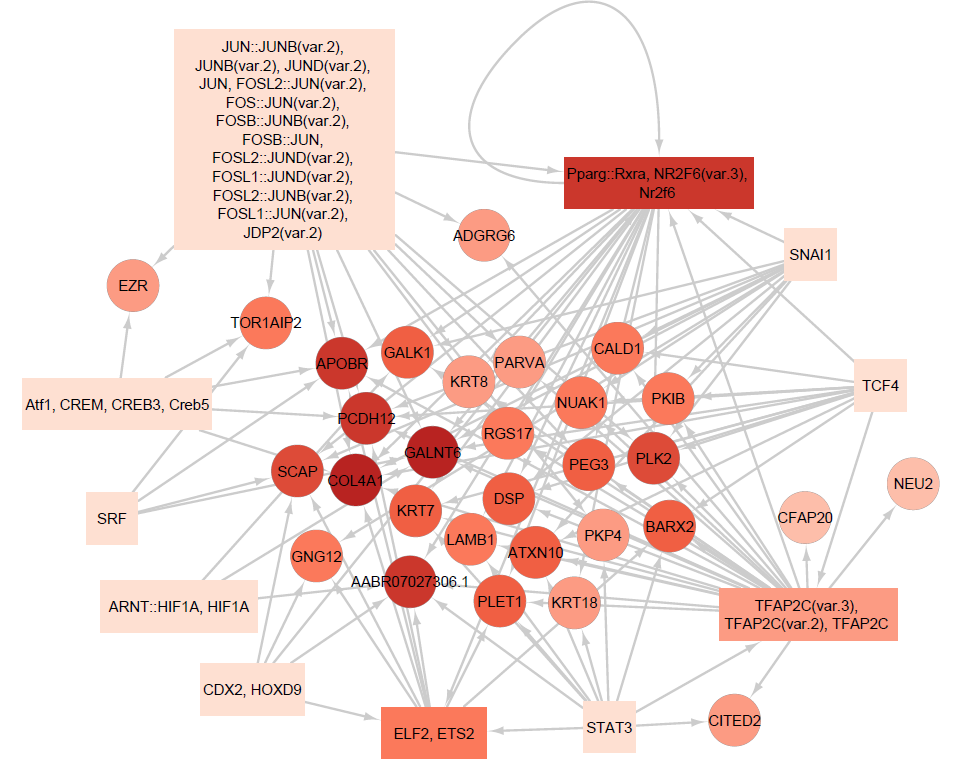
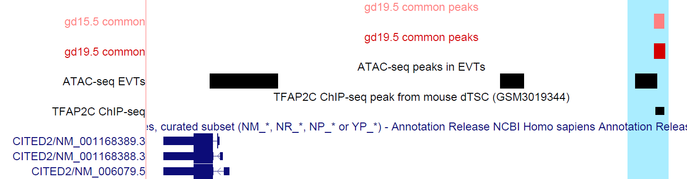

  
```{r setup, include=FALSE}
options(max.print = "75")
knitr::opts_chunk$set(
  echo = TRUE,
  collapse = TRUE,
  comment = "#>",
  fig.path = "Files/",
  fig.width = 15,
  prompt = FALSE,
  tidy = FALSE,
  message = FALSE,
  warning = TRUE
)
knitr::opts_knit$set(width = 75)
```

This is a documentation for analyses of scATAC-seq data, generated from rat metrial gland tissues on gestational day (GD) 15.5 and 19.5. <br>

## Get common conserved peaks
First, convert rat peaks to Hg38 with LiftOver.   
The take overlapping regions with EVT ATAC-seq
```
bedtools intersect -a commonPeaks-gd19.5-hg38Coor.bed -b EVTpeaks.bed -wa -u > commonPeaks-gd19.5-hg38Coor-inEVT.bed
```
Check overlapping between common conserved ATAC with H3k27ac peaks in EVT
```
bedtools intersect -a commonPeaks-gd19.5-hg38Coor-inEVT.bed -b /work/LAS/geetu-lab/hhvu/varberg.et.al/ChIP_TS-CT1-EVT-K27ac_peaks/ChIP_TS-CT1-EVT-K27ac_peaks.narrowPeak -wa -wb > commonPeaks-gd19.5-hg38Coor-inAtacH3k27acEVT-Varberg.bed
bedtools intersect -a commonPeaks-gd19.5-hg38Coor-inEVT.bed -b /work/LAS/geetu-lab/hhvu/Frost.et.al/GSE200761_EVT_CutTag_H3K27ac_peaks.bed -wa -wb > commonPeaks-gd19.5-hg38Coor-inAtacH3k27acEVT-Frost.bed
```

```{r}
dat <- data.frame(`Rat_peaks_overlapping_with_H3k27ac_ChIP-seq`=c(104,264-104), `Rat_peaks_not_overlapping_with_H3k27ac_ChIP-seq`=c(24,623))
rownames(dat) <- c("Rat peaks with H3k27ac", "Rat peaks without H3k27ac")
fisher.test(dat, alternative = "greater")

dat <- data.frame(`Rat_peaks_overlapping_with_H3k27ac_ChIP-seq`=c(64,264-64), `Rat_peaks_not_overlapping_with_H3k27ac_ChIP-seq`=c(8, 647-8))
rownames(dat) <- c("Rat peaks with H3k27ac", "Rat peaks without H3k27ac")
fisher.test(dat, alternative = "greater")
```

DA peaks have very low rate of conservation
```
sed 's/chr//g' ../daPeaks/gd19.5specific-TBCspecific-hg38.bed | bedtools intersect -a - -b EVTpeaks.bed -wa -u | wc -l          # 13
```

Test to see if common peaks have higher proportion of conserved peaks
```{r}
prop.test(c(264, 13), c(911, 124), p = NULL, alternative = "greater")
```

## Conserved common peak - conserved common gene networks:
Build list of genes that are TBC markers at both gd15.5 and gd19.5 that are conserved in human EVT using scRNA-seq data, and these markers are also near to the common peaks.
```{r}
library(dplyr)

closest_genes <- read.table("/work/LAS/geetu-lab/hhvu/project3_scATAC/scATAC-seq-analysis/5_integrating2timepoints/annotation_scRNAseq/commonPeaks/commonPeaks-gd19.5-toGenes.txt", header = T, sep = "\t")
marker15.5 <- read.table("/work/LAS/geetu-lab/hhvu/project3_scATAC/scATAC-seq-analysis/4_RNAintegration/scRNA-seqFiles/gd15.5-wilcoxin-cluster23.txt", header = T, sep = "\t")
marker19.5 <- read.table("/work/LAS/geetu-lab/hhvu/project3_scATAC/scATAC-seq-analysis/4_RNAintegration/scRNA-seqFiles/gd19.5-wilcoxin-cluster6.txt", header = T, sep = "\t")
markers <- intersect(intersect(marker15.5$gene, marker19.5$gene), closest_genes$gene_name)

conservedRats <- read.table("/work/LAS/geetu-lab/hhvu/project3_scATAC/scATAC-seq-analysis/5_integrating2timepoints/annotation_scRNAseq/commonPeaks/conservedRat.txt", header = T, sep = "\t")

markers <- markers[which(toupper(markers) %in% conservedRats$ratGenes == T)]

length(markers)
```


Find peaks with enriched motifs and are also conserved
```{r}
motifs19.5 <- read.table("/work/LAS/geetu-lab/hhvu/project3_scATAC/scATAC-seq-analysis/5_integrating2timepoints/annotation_scRNAseq/commonPeaks/finalMotifs-commonPeaksGD19.5coor.txt", sep = "\t")
motifPeaks <- read.table("/work/LAS/geetu-lab/hhvu/project3_scATAC/scATAC-seq-analysis/5_integrating2timepoints/annotation_scRNAseq/commonPeaks/commonPeaksGD19.5withFinalMotifs.txt", header = T, sep = "\t")
motifPeaks$peak <- sub("chr", "", motifPeaks$peak)
motifPeaks$peak <- sub(":", "-", motifPeaks$peak)
conservedPeaks <- read.table("/work/LAS/geetu-lab/hhvu/project3_scATAC/scATAC-seq-analysis/5_integrating2timepoints/annotation_scRNAseq/commonPeaks/commonPeaks-gd19.5-hg38Coor-inEVT.bed", header = F)
motifPeaks <- motifPeaks[motifPeaks$peak %in% conservedPeaks$V4,]
```

Number of pekas with enriched motifs and are also conserved
```{r}
length(unique(motifPeaks$peak))
```

Associate peaks/motifs to genes
```{r}
network <- inner_join(closest_genes, motifPeaks, by = c("query_region" = "peak"))
network <- inner_join(network, motifs19.5[,c("motif", "motif.name")], by = c("motif" = "motif"))
network <- network[network$gene_name %in% markers,]
dim(network)

network <- distinct(network)

length(unique(network$gene_name))

#network$query_region <- paste0("chr", network$query_region)
#network$query_region <- sub("-", ":", network$query_region)
#write.table(network, "/work/LAS/geetu-lab/hhvu/project3_scATAC/scATAC-seq-analysis/5_integrating2timepoints/annotation_scRNAseq/commonPeaks/tableS4_1.txt", sep = "\t", row.names = F, quote = F)
```

Grouping motifs of the same gene families together. Here if two families shared an element, I will also merge them together.
```{r}
subColon <- function(x) {
  ifelse(grepl("::", x, ignore.case = TRUE), strsplit(x, "::"), x)
}

jaspar <- read.table("/work/LAS/geetu-lab/hhvu/JASPAR-library.txt", header = T, sep = "\t")
jaspar <- jaspar[jaspar$ID %in% network$motif,]
network <- inner_join(network, jaspar[,c("ID", "Family")], by = c("motif" = "ID"))
network <- network[order(network$Family, decreasing = T),]
keep_network <- network$Family
keep_network <- subColon(keep_network)
for (i in 1:length(keep_network)) {
  keep_network[i] <- list(unique(keep_network[i][[1]]))
  for (j in setdiff(1:length(keep_network), which(keep_network %in% keep_network[i]))) {
    if (sum(keep_network[j][[1]] %in% keep_network[i][[1]]) > 0) {
      keep_network[j] <- keep_network[i]
    }
  }
}
keep2_network <- unlist(lapply(keep_network, toString))
network$Family2 <- keep2_network
network$Family2[grep("Jun|Fos", network$Family2, value = F)] <- "Jun-related factors, Fos-related factors"

all <- data.frame(tfGene=character(), regGene=character())
for (i in unique(network$Family2)) {
  tfGene <- unique(network[which(network$Family2 == i), "motif.name"])
  tf <- toString(tfGene)
  regGene <- unique(network[which(network$Family2 == i), "gene_name"])
  tbl <- data.frame(matrix(nrow = length(tfGene)*length(regGene), ncol = 2))
  for (j in 1:length(tfGene)) {
    tbl[((j-1)*length(regGene)+1):(j*length(regGene)),1] <- tf
    tbl[((j-1)*length(regGene)+1):(j*length(regGene)),2] <- as.character(regGene)
  }
  all <- rbind(all, tbl)
}
all$X2 <- toupper(all$X2)
all <- dplyr::distinct(all)

g <- unique(all$X2)
for (k in 1:length(g)) {
  if (length(grep(g[k], all$X1, ignore.case = T)) != 0) {
    all[which(g[k] == all$X2), "X2"] <- all[grep(g[k], all$X1, ignore.case = T)[1], "X1"]
  }
}
all <- dplyr::distinct(all)

write.table(all, "/work/LAS/geetu-lab/hhvu/project3_scATAC/scATAC-seq-analysis/5_integrating2timepoints/annotation_scRNAseq/commonPeaks/conservedCommonPeaksGenes-gd19.5.txt", sep = "\t", row.names = F, quote = F)
```

Build network in Cytoscape.
```{r}

```

Genes with most associated motifs:
```{r}
sort(table(all$X2))[(length(table(all$X2))-10):length(table(all$X2))]
```

TFs with most genes:
```{r}
sort(table(all$X1))[(length(table(all$X1))-5):length(table(all$X1))]
```

To plot Figure 4B:
```{r, eval = F}
library(Signac)
library(Seurat)
library(ggplot2)
library(GenomicRanges)
library(patchwork)
library(ensembldb)
library(biovizBase)

load("/work/LAS/geetu-lab/hhvu/project3_scATAC/scATAC-seq-analysis/5_integrating2timepoints/merged2timepoints.rda")
merged2tp <- RenameIdents(merged2tp, `GD15.5_TBC` = "GD15.5_Trophoblast_cells", `GD19.5_TBC` = "GD19.5_Trophoblast_cells")
DefaultAssay(merged2tp) <- "combined"

frags <- Fragments(merged2tp)  # get list of fragment objects
Fragments(merged2tp) <- NULL  # remove fragment information from assay
frags[[1]] <- UpdatePath(frags[[1]], new.path = "/work/LAS/geetu-lab/hhvu/project3_scATAC/data/scATAC-seq/GD15.5/integratedFragments/fragments.tsv.gz")  # update path. Do this for any/all fragment objects in the list
frags[[2]] <- UpdatePath(frags[[2]], new.path = "/work/LAS/geetu-lab/hhvu/project3_scATAC/data/scATAC-seq/GD19.5/integratedFragments/fragments.tsv.gz")  # update path. Do this for any/all fragment objects in the list
Fragments(merged2tp) <- frags  # assign update list of fragment objects back to the assay

file <- ensDbFromGtf("/work/LAS/geetu-lab/hhvu/project3_scATAC/scATAC-seq-analysis/Rattus_norvegicus.Rnor_6.0.98.gtf")
rnor6.ensDB <- EnsDb(file)
annotations <- suppressWarnings(GetGRangesFromEnsDb(ensdb = rnor6.ensDB))
seqlevelsStyle(annotations) <- "Ensembl"
Annotation(merged2tp) <- annotations

col <- c("#FF8080", "#D40000")

cov_plot <- CoveragePlot( 
  object = merged2tp,
  region = "1-12808761-12809434", #13928 from gene, coaccess with 1-12821801-12824732 (promoter peak)
  #feature = "Cited2",
  annotation = TRUE,
  peaks = TRUE,
  heights = c(6, 1, 1),
  extend.upstream = 8000,
  extend.downstream = 25000,
  idents = c("GD15.5_Trophoblast_cells", "GD19.5_Trophoblast_cells")
)
wrap_elements(cov_plot & scale_fill_manual(values = col) & xlab("Chromosome 1 position")) + ggtitle("Distal peak associated with Cited2") + theme(plot.title = element_text(size=18, face = "bold")) 
```

```{r}

```
